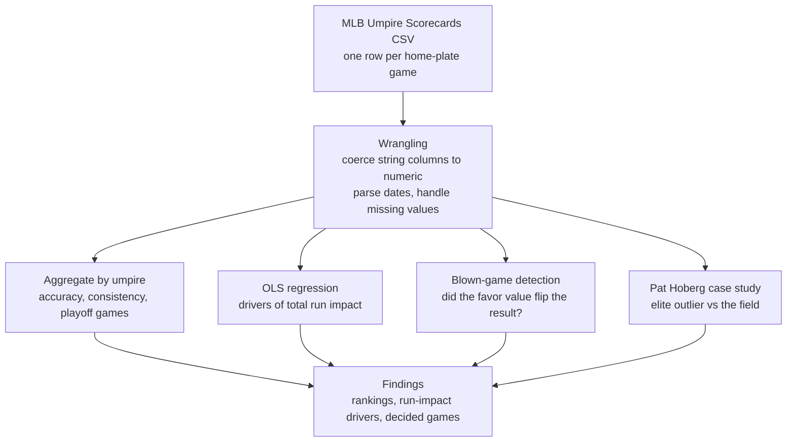

# MLB Umpire Scorecard Analysis

**Data wrangling and exploratory analysis of MLB home-plate umpire performance.**

This project digs into the public Umpire Scorecards dataset to put real numbers on how well MLB home-plate umpires call balls and strikes. It works through a handful of questions. Which umpires are the most accurate? What drives the run impact of a missed call? How many games get flipped by bad calls? And what does the data say about an umpire who landed at the center of a real gambling scandal?

<p>
  
  
  
  
  
  
</p>

---

> ### TL;DR
> - **The data.** A dataset of MLB home-plate umpire scorecards, one row per game, with a block of accuracy metrics stored as strings that needed cleaning before any math could happen.
> - **The questions.** Which umpires call the most accurate game, what a missed call does to the run impact, how often an umpire flips a result, and whether the numbers show anything off about a scandal-tied name.
> - **A few findings.** The gap between the best and worst umpires is surprisingly small. In absolute terms, an incorrect call carries more than twice the run impact of a correct one. And 296 games in the dataset had their outcome flipped by the net of a home-plate umpire's missed calls.
> - **The case study.** Pat Hoberg, later removed by MLB over a gambling-policy violation, owns the only perfect game in the dataset and grades out as an elite, consistent umpire whose on-field numbers show no sign of manipulation.

---

## Table of Contents
1. [The Questions](#1-the-questions)
2. [The Data and the Wrangling](#2-the-data-and-the-wrangling)
3. [System Overview](#3-system-overview)
4. [Ranking the Umpires](#4-ranking-the-umpires)
5. [What Drives Run Impact](#5-what-drives-run-impact)
6. [Games Decided by Umpires](#6-games-decided-by-umpires)
7. [The Pat Hoberg Case](#7-the-pat-hoberg-case)
8. [Limitations](#8-limitations)
9. [Future Directions](#9-future-directions)
10. [Tech Stack](#10-tech-stack)
11. [Repository Structure](#11-repository-structure)
12. [Reproducing the Analysis](#12-reproducing-the-analysis)
13. [About the Author](#13-about-the-author)

---

## 1. The Questions

Every pitch a catcher takes turns into a judgment call, and over a full season those calls pile up into real wins and losses. The Umpire Scorecards data puts a number on each home-plate umpire's accuracy, game by game, which opens the door to a few questions worth chasing.

Who actually calls the most accurate game? Does accuracy line up with the umpires who get the playoff assignments? When a call goes wrong, how much does it move the result? And in a sport that has started taking gambling integrity seriously, does the on-field data show anything strange about an umpire who got caught up in a scandal?

I came to this one with a personal stake. I umpired baseball for years, so who calls a good game, and how you would even measure it, is a question I have lived behind the plate as well as in front of a dataset.

---

## 2. The Data and the Wrangling

The source is the public Umpire Scorecards dataset, with one row per game and the home-plate umpire's full call breakdown attached: pitches called, correct and incorrect calls, expected values for each, an accuracy score, a consistency score, a home-favoritism measure, and the total run impact of the night's missed calls.

The catch was that a block of these numeric columns came in as strings, which makes any math impossible until they are converted. The first real step was coercing those columns to numbers and letting the unparseable values fall out as missing. From there the dates got parsed into proper datetimes, which later powered a playoff-game flag, and rows missing key fields got dropped wherever a clean calculation required it.

This is the unglamorous part of the job, and it is where a lot of analyses quietly go wrong. Numbers that look fine in a table can be text under the hood, and one un-coerced column will break a groupby or silently poison a regression.

---

## 3. System Overview



---

## 4. Ranking the Umpires

The first pass grouped every game by umpire and pulled the average accuracy and consistency, each with its standard deviation, plus the average run impact. The headline from that exercise was almost an anti-climax. The spread between the best and worst umpires on accuracy and consistency is thin. The league's plate umpires are, as a group, very good and very similar.

To add a quality signal beyond the raw scores, I flagged playoff games using the calendar (October and November dates) and counted how many each umpire worked behind the plate. The logic is that the league saves its biggest assignments for its best people, so playoff volume should track quality. That signal comes with a real caveat. This dataset logs only home-plate games, and umpires rotate to the bases during a playoff series, so the count understates how much postseason work each one saw.

The merged view, accuracy and consistency and playoff counts side by side, put a small surprise on the table. The most accurate umpires were not the ones drowning in playoff assignments.

| Umpire | Mean Accuracy | Consistency | Playoff Games |
|---|---|---|---|
| John Libka | 94.96% | 93.86% | 1 |
| Brock Ballou | 94.90% | 95.20% | 0 |
| Edwin Moscoso | 94.64% | 93.82% | 1 |
| Jeremie Rehak | 94.63% | 93.64% | 3 |
| Jansen Visconti | 94.57% | 94.00% | 3 |
| Alex Tosi | 94.50% | 93.63% | 1 |
| Adam Beck | 94.41% | 94.10% | 2 |
| Jeremy Riggs | 94.31% | 93.64% | 0 |
| Junior Valentine | 94.27% | 93.79% | 0 |
| Lew Williams | 94.23% | 93.48% | 0 |

The top of the accuracy board is full of names with no more than three playoff games apiece. The umpires racking up the most postseason work, like Ted Barrett with fourteen playoff games, sit lower on raw accuracy. Postseason assignments seem to reward a longer reputation and a fuller body of work than a single accuracy column can capture.

---

## 5. What Drives Run Impact

Each game in the data carries a total run impact, the net run value of the umpire's missed calls. I fit an ordinary least squares regression to see which inputs push that number around, adding a couple of interaction terms (accuracy above expected times correct calls above expected, and pitches called times correct calls) on top of the raw counts.

The model explains about 67% of the variance in run impact, and the coefficients tell a tidy story. In absolute terms, an incorrect call carries more than twice the run-impact weight of a correct call or a correct call above expectation. A blown call simply moves the game more than a good one does, which fits how a single missed strike three in a tight spot can swing an inning.

A word of caution belongs right here, and the model itself raises it. The condition number on this regression is enormous, a red flag for severe multicollinearity. That makes sense, because total run impact is built out of the very call counts being used to predict it, so the features overlap heavily with one another and with the target. The directional read holds up and matches intuition, but the precise coefficient values and their standard errors should be treated as shaky rather than exact.

---

## 6. Games Decided by Umpires

The most striking question in the project was also the simplest to state. How many games did the umpire effectively decide? To get at it, I took each game's final margin, subtracted the home-favoritism run value from the home team's total, and checked whether that adjustment flipped the sign of the result. If pulling the umpire's net favor turns a home win into a loss, or the reverse, the call swung the game.

By that definition, 296 games in the dataset had their outcome flipped by the net of a home-plate umpire's missed calls. The umpires who decided the most games were Lance Barrett and Doug Eddings with eight apiece, followed by Joe West, Vic Carapazza, and Phil Cuzzi.

Flipped games also looked different under the hood. They ran longer, averaging about 170.7 called pitches against roughly 154.6 across the full dataset. That fits the intuition that the games most exposed to a deciding call are the close, grinding ones that go deep into the night.

I also charted how often each team turned up in these flipped games. Counted by home team, the Nationals, Braves, Yankees, Guardians, and Red Sox came out on top.


*Home teams appearing most often in games flipped by a home-plate umpire's net missed calls.*

---

## 7. The Pat Hoberg Case

The last section turned the data toward a single name. Pat Hoberg was removed by MLB in 2024 over a violation of the league's gambling policy, a story that put his entire body of work under a new kind of scrutiny. I wanted to see what his on-field numbers showed.

The headline jumps out immediately. The dataset contains exactly one perfect game, a 100% accuracy night, and it belongs to Hoberg: Game 2 of the 2022 World Series, 129 called pitches, not a single one missed. To put that in context, I built a heatmap comparing his career averages against the league-wide averages and against the averages of the games that got flipped by missed calls.


*Pat Hoberg's average metrics against the league-wide average and the average of flipped games.*

The picture is consistent across every metric. Hoberg grades out as an elite, highly consistent umpire who sits well clear of the profile you find in games decided by bad calls. There is an important boundary on what this can claim. The data speaks only to his ball-and-strike accuracy on the field, and on that front it shows no sign of manipulation. It cannot address the off-field conduct that ended his career, and it does not try to.

---

## 8. Limitations

I would rather name the soft spots than leave a reader to find them.

- **The run-impact regression is multicollinear.** Total run impact is derived from the same call counts used to predict it, so the model overlaps with its own target and the condition number is enormous. The directional finding survives, but individual coefficients and standard errors are not trustworthy on their own.
- **Flipped games rest on a simplified counterfactual.** Subtracting the home-favoritism value and checking for a sign change assumes those runs would have landed cleanly and the rest of the game would have played out the same way. Real games do not work that cleanly, so 296 is a useful estimate rather than a literal count of stolen wins.
- **The data is home-plate only.** It captures ball-and-strike calls and nothing else. Field calls, replay reviews, and an umpire's work on the bases all sit outside it, which is also why the playoff-game counts undercount postseason work.
- **Team attribution needs refinement.** The team-level view counts the home team in each flipped game, so it does not yet separate the club that was wronged from the one that simply happened to be hosting. Pinning down who actually lost out means using the direction of the favor value.
- **The accuracy spread is narrow.** The best and worst umpires sit close together and their standard deviations overlap heavily, so any "best umpire" ranking is fragile and should not be read as a hard order.
- **Assignment is not random.** Umpires are scheduled, and the best draw the playoffs, so comparisons across umpires carry selection effects that a simple average cannot remove.

---

## 9. Future Directions

- **Model accuracy properly.** A mixed-effects model with an umpire random effect and game-context fixed effects would rank umpires while accounting for sample size and the situations they worked, which a raw average cannot do.
- **Upgrade the flipped-game logic.** Swapping the sign-change heuristic for a win-probability model would measure the true leverage of each missed call instead of treating every run as equal.
- **Fix the team attribution.** Using the direction of the favor value would turn the team view into a real account of which clubs lost out most to missed calls.
- **Go to the pitch level.** Pulling Statcast pitch locations would show where umpires miss, by zone, by count, and in the high-leverage spots that decide games.
- **Track trends over time.** Following accuracy season by season would show whether tighter scrutiny and pitch tracking have moved the needle.
- **Map home-team favoritism.** The favor value across umpires and ballparks could reveal whether certain crews or venues tilt one way.

---

## 10. Tech Stack

| Category | Tools |
|---|---|
| **Language** | Python 3.10+ |
| **Report** | Quarto (rendered to GitHub-flavored Markdown) |
| **Wrangling** | `pandas` |
| **Modeling** | `statsmodels` (OLS), `scikit-learn` (train/test split, metrics) |
| **Visualization** | `plotnine`, `matplotlib` |
| **Data** | Umpire Scorecards public dataset |

---

## 11. Repository Structure

```
mlb-umpire-scorecard-analysis/
├── README.md
├── umpire_analysis.qmd          # Quarto source: wrangling, rankings, regression, case study
├── data/
│   └── mlb-umpire-scorecard.csv
├── reports/
│   └── figures/
│       ├── flipped_games_by_team.png
│       └── hoberg_heatmap.png
└── .gitignore
```

---

## 12. Reproducing the Analysis

The analysis lives in a Quarto document. Point it at the dataset, then render it or run the cells in a notebook.

```bash
# 1. Environment
python -m venv .venv && source .venv/bin/activate
pip install -r requirements.txt

# 2. Render the report (Quarto must be installed separately)
quarto render umpire_analysis.qmd
```

One thing to update before running: the dataset path is hardcoded near the top of the document, so point it at wherever your copy of `mlb-umpire-scorecard.csv` lives.

**`requirements.txt`**
```
pandas
numpy
statsmodels
scikit-learn
plotnine
matplotlib
```

---

## 13. About the Author

Built by **Tommy Gillan**. I hold an M.S. in Business Analytics with a Sports Analytics concentration from the University of Notre Dame, and I have spent years in and around baseball as a player, umpire, coach, and writer.

This project is the one that hits closest to home. I spent years calling games behind the plate, so a dataset that grades umpires the way this one does is something I could not leave alone. The wrangling and the regression are the analyst's half of the work. Knowing what a missed strike three in the eighth actually costs a team is the umpire's half, and this project is what happens when both halves get to weigh in.

*Connect:* [LinkedIn](https://www.linkedin.com/in/tommy-gillan/) · [Email](mailto:thomasgillan63@gmail.com) · [Portfolio](https://github.com/tgillz63)

---

<sub>Data from the public Umpire Scorecards project. This is an independent research project with no affiliation to Major League Baseball or the Umpire Scorecards project.</sub>
