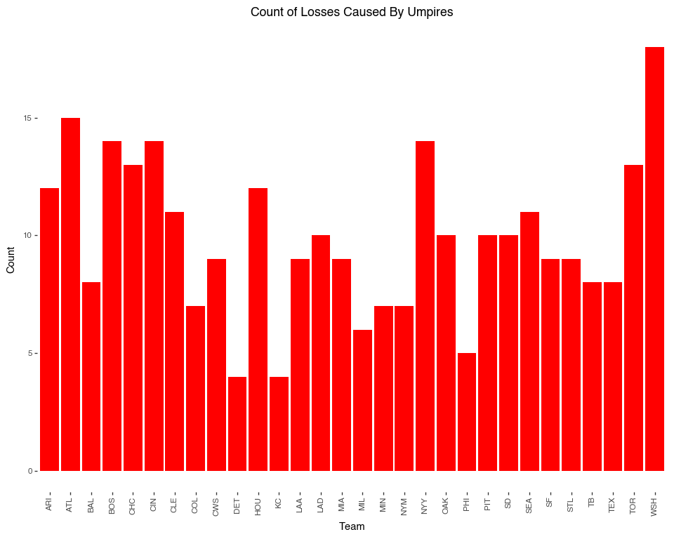
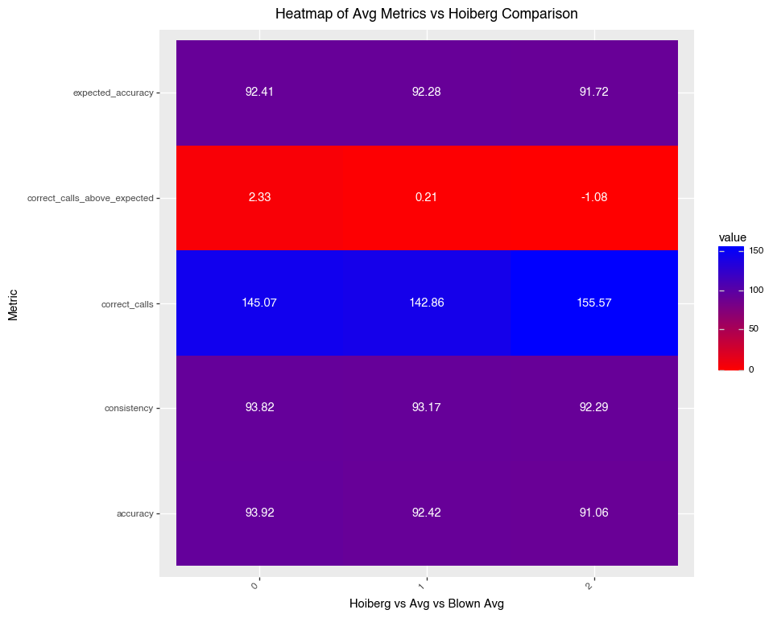

# Umpire Scorecard Data Wrangling Project
Tommy Gillan

## Who are the best umpires?

``` python
import pandas as pd
from plotnine import *
from sklearn.model_selection import train_test_split
import statsmodels.api as sm
from sklearn.metrics import mean_squared_error, r2_score
import matplotlib.pyplot as plt

ump_df= pd.read_csv('/Users/tommygillan/Downloads/mlb-umpire-scorecard.csv')
```

### There are numeric variables stored as strings here that need to be converted to work with the data.

``` python
cols = ump_df.columns[6:20]
ump_df[cols] = ump_df[cols].apply(pd.to_numeric, errors='coerce')
```

### Highest avg accuracy, consistency, and total run impact sorted with std deviation included. It is shown that there isn’t a huge difference between the best and worst umpires when looking at accuracy and consistency.

``` python
accuracy=ump_df.groupby('umpire')['accuracy'].aggregate(['mean', 'std']).sort_values(by='mean',ascending=False)
accuracy.head(20)
consistency=ump_df.groupby('umpire')['consistency'].aggregate(['mean', 'std']).sort_values(by='mean',ascending=False)
consistency.head(20)
total_impact=ump_df.groupby('umpire')['total_run_impact'].mean().sort_values(ascending=False)
```

### Created a playoff vs regular season boolean variable ere and summed the amount of playoff games each umpire worked. In general this is a good metric to tell how good an umpire is because only the best work in the playoffs. But this dataset only shows games umpired behind home plate and many of these umpires are rotating as field umpires during the playoffs as well.

``` python
ump_df['date'] = pd.to_datetime(ump_df['date'],errors='coerce')
ump_df['playoff_game'] = ump_df['date'].dt.month.isin([10, 11])
playoff_counts = ump_df.groupby('umpire')['playoff_game'].sum().sort_values(ascending=False)
playoff_counts.head(15)
```

    umpire
    Ted Barrett        14
    Lance Barksdale    12
    Chris Guccione     12
    James Hoye         11
    Jeff Nelson        11
    Jim Wolf           11
    Dan Iassogna       11
    Mark Carlson       11
    Alan Porter        11
    Alfonso Marquez    11
    Bill Miller        10
    Dan Bellino        10
    Laz Diaz           10
    Angel Hernandez     9
    Marvin Hudson       9
    Name: playoff_game, dtype: int64

### Merging accuracy and consistency tables created above, as well as number of playoff games umpired. It is shown here that the umpires with the highest accuracy are not neccesarily the ones doing a ton of playoff games.

``` python
merge1=pd.merge(accuracy, consistency, on='umpire',how='left')
merge1 = merge1.rename(columns={
    'mean_x': 'accuracy_mean',
    'std_x': 'accuracy_std',
    'mean_y': 'consistency_mean',
    'std_y': 'consistency_std',
    })
merge2= pd.merge(merge1, playoff_counts, on='umpire', how='left')
merge2

top10 = merge2.sort_values('accuracy_mean', ascending=False).head(10)
top10
```

<div>
<style scoped>
    .dataframe tbody tr th:only-of-type {
        vertical-align: middle;
    }
&#10;    .dataframe tbody tr th {
        vertical-align: top;
    }
&#10;    .dataframe thead th {
        text-align: right;
    }
</style>

|  | accuracy_mean | accuracy_std | consistency_mean | consistency_std | playoff_game |
|----|----|----|----|----|----|
| umpire |  |  |  |  |  |
| John Libka | 94.956667 | 1.865239 | 93.857500 | 2.139530 | 1 |
| Brock Ballou | 94.900000 | 1.307670 | 95.200000 | 1.324135 | 0 |
| Edwin Moscoso | 94.639759 | 1.830763 | 93.819277 | 1.883203 | 1 |
| Jeremie Rehak | 94.630894 | 2.235303 | 93.642276 | 2.238083 | 3 |
| Jansen Visconti | 94.567669 | 2.074322 | 93.996992 | 2.085191 | 3 |
| Alex Tosi | 94.500000 | 2.176935 | 93.634884 | 2.120521 | 1 |
| Adam Beck | 94.406452 | 2.052657 | 94.104839 | 2.086131 | 2 |
| Jeremy Riggs | 94.308197 | 2.027749 | 93.642623 | 1.978169 | 0 |
| Junior Valentine | 94.266667 | 1.823122 | 93.792593 | 2.086059 | 0 |
| Lew Williams | 94.225000 | 1.330100 | 93.475000 | 1.257975 | 1 |

</div>

## Total run impact linear regression, when looking at the absolute value of the coeffients imcorrect calls will have over twice the impact of correct calls and correct calls above expected.

``` python
dropped_ump=ump_df.dropna()

x=dropped_ump.drop(['total_run_impact','umpire','home','away','id','date', 'playoff_game'] ,axis=1)
y=dropped_ump['total_run_impact']
x['accuracy_above'] = dropped_ump['correct_calls_above_expected'] * dropped_ump['accuracy_above_expected']
x['pitchs_correct'] = dropped_ump['pitches_called'] * dropped_ump['correct_calls']
X_train, X_test, y_train, y_test = train_test_split(x, y, test_size=0.2, random_state=42)
X_sm = sm.add_constant(x)  
model = sm.OLS(y, X_sm).fit()
print(model.summary())
```

                                OLS Regression Results                            
    ==============================================================================
    Dep. Variable:       total_run_impact   R-squared:                       0.673
    Model:                            OLS   Adj. R-squared:                  0.673
    Method:                 Least Squares   F-statistic:                     3106.
    Date:                Sat, 13 Dec 2025   Prob (F-statistic):               0.00
    Time:                        02:22:26   Log-Likelihood:                -10904.
    No. Observations:               18093   AIC:                         2.183e+04
    Df Residuals:                   18080   BIC:                         2.194e+04
    Df Model:                          12                                         
    Covariance Type:            nonrobust                                         
    ================================================================================================
                                       coef    std err          t      P>|t|      [0.025      0.975]
    ------------------------------------------------------------------------------------------------
    const                           -7.3204      1.109     -6.602      0.000      -9.494      -5.147
    home_team_runs                   0.0082      0.001      7.629      0.000       0.006       0.010
    away_team_runs                   0.0021      0.001      1.840      0.066      -0.000       0.004
    pitches_called                   0.0440      0.002     26.225      0.000       0.041       0.047
    incorrect_calls                  0.0836      0.002     34.545      0.000       0.079       0.088
    expected_incorrect_calls         0.0444      0.004     11.185      0.000       0.037       0.052
    correct_calls                   -0.0396      0.002    -24.319      0.000      -0.043      -0.036
    expected_correct_calls          -0.0004      0.003     -0.144      0.885      -0.005       0.005
    correct_calls_above_expected    -0.0392      0.004    -11.020      0.000      -0.046      -0.032
    accuracy                         0.1070      0.066      1.625      0.104      -0.022       0.236
    expected_accuracy               -0.0369      0.066     -0.558      0.577      -0.167       0.093
    accuracy_above_expected         -0.0514      0.066     -0.779      0.436      -0.181       0.078
    consistency                  -3.802e-05      0.002     -0.022      0.982      -0.003       0.003
    favor_home                       0.0259      0.005      5.015      0.000       0.016       0.036
    accuracy_above                  -0.0002      0.000     -0.799      0.424      -0.001       0.000
    pitchs_correct                -1.12e-05   3.19e-06     -3.511      0.000   -1.74e-05   -4.95e-06
    ==============================================================================
    Omnibus:                     4614.998   Durbin-Watson:                   1.991
    Prob(Omnibus):                  0.000   Jarque-Bera (JB):            15495.734
    Skew:                           1.278   Prob(JB):                         0.00
    Kurtosis:                       6.744   Cond. No.                     2.03e+19
    ==============================================================================

    Notes:
    [1] Standard Errors assume that the covariance matrix of the errors is correctly specified.
    [2] The smallest eigenvalue is 2.5e-26. This might indicate that there are
    strong multicollinearity problems or that the design matrix is singular.

## How many games were ’decided by umpires?(Game result flipped as a result of directional run impact). 296 games flipped by incorrect umpire calls! What umpires decided the most games?

``` python
def posneg(x):
    if x>0: return 1
    if x<0: return -1
    else: return 0

ump_df=ump_df.dropna(subset='favor_home')
blowngames = 0
blown_rows = []

for i in range(len(ump_df)):
    row = ump_df.iloc[i]

    margin = row['home_team_runs'] - row['away_team_runs']
    home_adj = row['home_team_runs'] - row['favor_home']
    adj_diff = home_adj - row['away_team_runs']

    if posneg(margin) != posneg(adj_diff):
        blowngames += 1
        blown_rows.append(row)

blowngames
blown_df=pd.DataFrame(blown_rows)
blown_df

blown_df['umpire'].value_counts()
```

    umpire
    Lance Barrett      8
    Doug Eddings       8
    Joe West           7
    Vic Carapazza      6
    Phil Cuzzi         5
                      ..
    Nick Mahrley       1
    Jeremie Rehak      1
    Eric Cooper        1
    Jansen Visconti    1
    Chris Conroy       1
    Name: count, Length: 98, dtype: int64

### There are signicantly more average pitches in a blown game, about 154.562 compared to about 170.739 .

``` python
blown_df['pitches_called'].mean()
ump_df['pitches_called'].mean()
blownavg= blown_df.aggregate('mean', numeric_only=True)
```

### What teams were most affected by blown games? In this dataset, Washington Nationals, Atlanta Braves, New York Yankees, Clevland Guardians, and Boston Red Sox.

``` python
blown_df
blown_df.loc[blown_df['home'] > blown_df['away'], 'team_cheated'] = blown_df['home']
blown_df.loc[blown_df['home'] <= blown_df['away'], 'team_cheated'] = blown_df['home']
blown_df['team_cheated'].value_counts()

plot=(ggplot(blown_df, aes(x='team_cheated'))
 + geom_bar(fill='red')  
 +theme(
      figure_size=(10, 8),
    axis_text_x = element_text(angle = 90),
     panel_grid_major=element_blank(),
     panel_grid_minor=element_blank(),
     panel_border=element_blank(),
     panel_background=element_blank()
 )
 + labs(title='Count of Losses Caused By Umpires', x='Team', y='Count')
)

plot.show()
```



## What does the data say about former umpire Pat Hoberg?

### Only one perfect game(100% accuracy) in dataset by Pat Hoberg in game 2 of 2022 World Series.

``` python
perfect_accuracy= ump_df[ump_df['accuracy']==100]
perfect_accuracy
```

<div>
<style scoped>
    .dataframe tbody tr th:only-of-type {
        vertical-align: middle;
    }
&#10;    .dataframe tbody tr th {
        vertical-align: top;
    }
&#10;    .dataframe thead th {
        text-align: right;
    }
</style>

|  | id | date | umpire | home | away | home_team_runs | away_team_runs | pitches_called | incorrect_calls | expected_incorrect_calls | correct_calls | expected_correct_calls | correct_calls_above_expected | accuracy | expected_accuracy | accuracy_above_expected | consistency | favor_home | total_run_impact | playoff_game |
|----|----|----|----|----|----|----|----|----|----|----|----|----|----|----|----|----|----|----|----|----|
| 4 | 5 | 2022-10-29 | Pat Hoberg | HOU | PHI | 5 | 2 | 129.0 | 0.0 | 8.7 | 129.0 | 120.3 | 8.7 | 100.0 | 93.2 | 6.8 | 96.1 | 0.0 | 0.0 | True |

</div>

### Begining to set up a heatmap of Hoberg mean scores a total avg accross all games, and an average of all games decided by umpires.

``` python
pat_h=ump_df[ump_df['umpire']=='Pat Hoberg']
pat_worst= pat_h.loc[pat_h['accuracy'].idxmin()]
pat_avg=pat_h.mean(numeric_only=True)
total_avg=ump_df.mean(numeric_only=True)
total_avg

compare = pd.concat([pat_avg, total_avg], axis=1, ignore_index=True)
compare=pd.concat([compare, blownavg], axis=1, ignore_index=True)
compare

compare.drop(['id','home_team_runs','away_team_runs','pitches_called','favor_home','incorrect_calls','expected_incorrect_calls',
'accuracy_above_expected','total_run_impact','playoff_game','expected_correct_calls'],axis=0, inplace=True)

compare

compare = compare.reset_index().melt(id_vars="index", 
                                     var_name="Hoiberg_vs_Avg_vs_Blown", 
                                     value_name="value")
```

### The 0 column is Hoberg’s averages, the 1 column is the averages across all games, the 2 column is the averages of blown games. By all metrics both in the heatmap and rest of dataset Pat Hoberg was an outstanding umpire who most likely did not engage in any nefarious gambling activity when it comes to the games he worked.

``` python
compare
compare
compare['value'] = pd.to_numeric(compare['value'], errors='coerce')
compare['value'] = compare['value'].round(2)

heat=( ggplot(compare, aes(x='Hoiberg_vs_Avg_vs_Blown', y='index', fill="value"))
    + geom_tile()
    + geom_text(aes(label='value'), color="white")
    + scale_fill_gradient(low="red", high="blue")
    + labs(
        title="Heatmap of Avg Metrics vs Hoiberg Comparison",
        x="Hoiberg vs Avg vs Blown Avg",
        y="Metric"
    )
    + theme(
        figure_size=(10, 8),
        axis_text_x=element_text(rotation=45, hjust=1)
    )
) 
heat.show()
```


